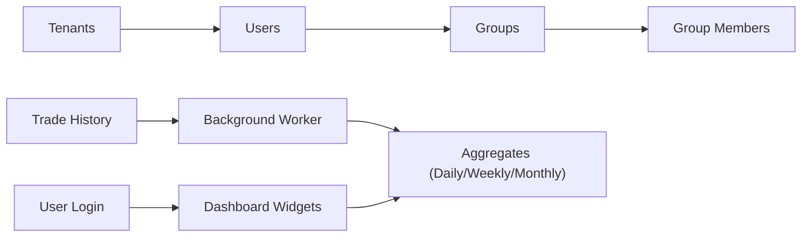
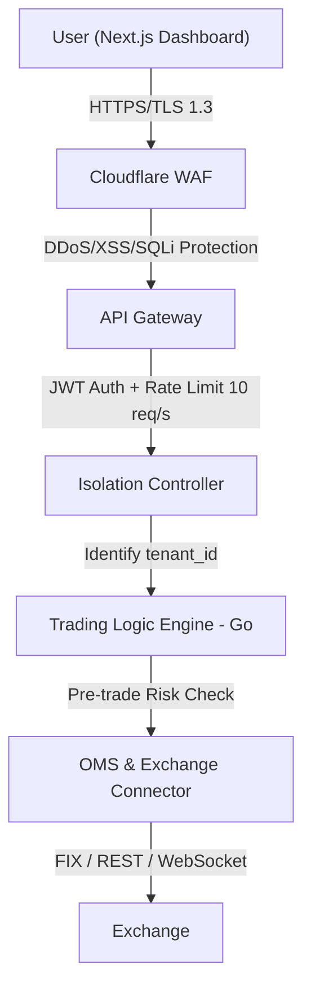
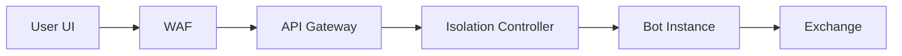
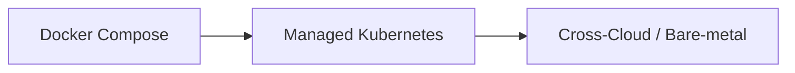

# 📚 สรุปเอกสาร Concept — ACI Trading Enterprise Edition (NexusFX)

เอกสารทั้ง 3 ฉบับออกแบบระบบเทรดดิ้งระดับ Enterprise ที่เน้น **Security-First**, **Infinite Scalability**, และ **Multi-tenancy** สำหรับทั้ง Retail Users และ B2B/White-label Partners

---

## 📄 1. Database Architecture (V2.2)

> กลยุทธ์ **Hybrid Multi-tenancy** — แยกข้อมูลธุรกรรมออกจากข้อมูลบริหารจัดการ

### Global Management Schema (Shared DB)
ฐานข้อมูลกลางสำหรับบริหารจัดการระบบ:

| กลุ่มตาราง | ตารางหลัก | หน้าที่ |
|---|---|---|
| **โบรกเกอร์** | `brokers_registry`, `asset_pairs` | ทะเบียนโบรกเกอร์, Protocol (FIX/WebSocket/REST), สินทรัพย์ |
| **สมาชิก** | `tenants`, `membership_plans` | จัดการ Tenant, แผนสมาชิก, ราคา |
| **สิทธิ์** | `permissions`, `roles`, `role_permissions` | RBAC — กำหนดสิทธิ์ตามบทบาท |

### Isolated User Schema (Per-Tenant DB)
ข้อมูลแยกตาม Tenant เพื่อความเป็นส่วนตัว:

| กลุ่มตาราง | ตารางหลัก | หน้าที่ |
|---|---|---|
| **ทีม** | `groups`, `group_members`, `user_accounts` | โครงสร้างกลุ่ม, ผู้ใช้, MFA |
| **การเงิน** | `wallets`, `financial_transactions` | กระเป๋าเงิน, Deposit/Withdraw |
| **เทรด** | `trading_bots`, `orders`, `trade_history`, `service_fee_logs` | คำสั่งซื้อขาย, ประวัติเทรด, ค่า Fee |
| **แดชบอร์ด** | `daily/weekly/monthly_aggregates`, `dashboard_widgets`, `bot_events` | ข้อมูลสรุปผลที่คำนวณล่วงหน้า |

### Flow สำคัญ

> [!IMPORTANT]
> **หลักการสำคัญ:** Dashboard ดึงข้อมูลจากตาราง Aggregates ที่คำนวณไว้แล้ว ไม่ Query ข้อมูลดิบโดยตรง — ลด Load ฐานข้อมูลอย่างมาก

---

## 📄 2. Detailed System & Data Flow Architecture

> **End-to-End Request Flow** ตั้งแต่ผู้ใช้กดเทรดจนถึง Exchange

### System Request Flow

### Data Flow — 2 ระดับ

| ประเภท | เทคโนโลยี | Latency | รายละเอียด |
|---|---|---|---|
| **Hot Data** (Market Data) | WebSocket → Redis Pub/Sub → Socket.io | < 50ms | Candlesticks, Stats แบบ Real-time |
| **Cold Data** (Transactions) | Kafka → PostgreSQL + TimescaleDB → S3 Glacier | — | Audit logs, Archive > 90 วัน |

### Bot Lifecycle (Automated Work Flow)
1. บอททำงานอัตโนมัติตาม Trading Signals + Real-time Context (Equity/Margin)
2. **Multi-level Risk Checks** — ทั้งระดับบุคคลและระดับทีม (Total Exposure)
3. **Settlement** — คำนวณ Success Fee โดยใช้ **High-Water Mark** principle

### Business Flow (B2B White-label)
- "Trading Infrastructure as a Service" สำหรับ Partners
- Automated provisioning: **Terraform + Ansible** → VPC, Subnets, K8s Namespaces
- Partners ปรับ Branding + Markups ได้ → Revenue Share 10%

### Monitoring & Recovery

> [!WARNING]
> **Emergency Kill Switch** — "Red Button" หยุดบอททั้งหมดและยกเลิก Open Orders ใน **< 1 วินาที**

- **Self-Healing:** Prometheus → K8s auto-restart failed pods → Restore state จาก Redis
- **Alerting:** Escalation เมื่อ Latency > 200ms หรือ Error Rate > 1%

---

## 📄 3. Trading System Architecture: Account-Centric Isolation (ACI)

> สถาปัตยกรรม **"Security-First"** ที่ข้อมูลผู้ใช้แต่ละคนเป็น **"Isolated Island"**

### กลยุทธ์ Isolation 3 ระดับ

| ระดับ | วิธีการ | รายละเอียด |
|---|---|---|
| **Data Isolation** | Schema-per-User (PostgreSQL) | Advanced Envelope Encryption, Partitioned Trade Logs |
| **Process Isolation** | Containerized Micro-bots (Docker/Micro-VM) | Actor Model ป้องกัน Noisy Neighbor |
| **Network Isolation** | Zero Trust Architecture | VPC Subnet Separation |

### Role-Based Features

| Role | ความสามารถ |
|---|---|
| **User** | Dynamic interface, Strategy Store, Personalized AI Analytics |
| **Team Lead** | Portfolio Aggregation, Global Stop-Loss, Profit Sharing |
| **Admin** | Real-time Infrastructure Monitoring, Financial Intelligence, Kill Switch |

### Architecture Flows

### Monetization Model

| รายได้ | รายละเอียด |
|---|---|
| **Subscription** | Tiered pricing ตามระดับผู้ใช้ |
| **Success Fee** | 15-25% จากกำไร |
| **White-label Setup** | $5,000 - $15,000 |
| **Volume Fee** | ค่าธรรมเนียมตามปริมาณการเทรด |

### Cost Analysis (ประมาณการรายเดือน)

| Scale | Infrastructure | ต้นทุน/เดือน |
|---|---|---|
| 100 Users | INET / VPS | ~$70 |
| 1,000 Users | AWS/GCP Managed | ~$500-$2,000 |
| 10,000+ Users | Multi-region AWS + CockroachDB | > $12,000 |

### Roadmap

---

## 🎯 Key Takeaways สำหรับการพัฒนา

> [!TIP]
> สิ่งสำคัญที่ต้องจำ:

1. **Multi-tenancy** — ใช้ Schema-per-Tenant แยกข้อมูลอย่างเด็ดขาด
2. **Performance** — Dashboard ใช้ Pre-aggregated Tables ไม่ Query ข้อมูลดิบ
3. **Security** — JWT Tenant Binding + Encryption at rest (DEK/KMS) + TLS 1.3
4. **Real-time** — Market Data ผ่าน Redis Pub/Sub + Socket.io (< 50ms)
5. **Bot Isolation** — แต่ละบอทรันใน Container แยก ป้องกัน Noisy Neighbor
6. **Risk Management** — Multi-level checks (Individual + Team) + Kill Switch
7. **Scalability** — เริ่มจาก Docker Compose → K8s → Multi-cloud
8. **Revenue** — Subscription + Success Fee (High-Water Mark) + White-label
9. **Data Pipeline** — Kafka สำหรับ Event Logging → TimescaleDB + S3 Archive
10. **RBAC** — Permission-based access control ผ่าน Middleware
