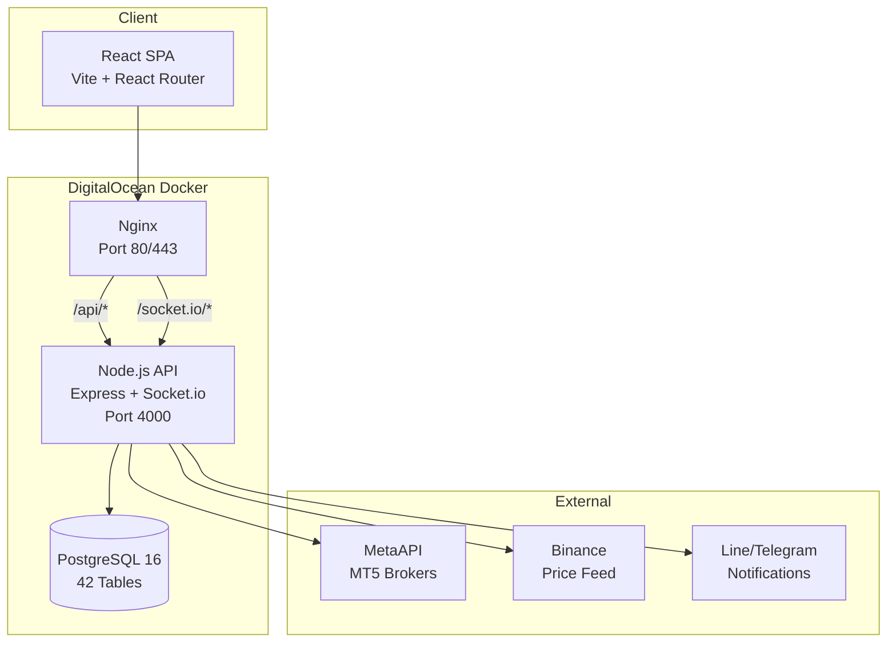

# 📋 NexusFX Trading Platform — Final Delivery Report

> **Date:** 3 April 2026  
> **Version:** 1.0.0  
> **Server:** 139.59.96.10 (DigitalOcean)  
> **Domain:** nexusfx.biz  
> **Status:** ✅ Production Ready

---

## 🏗️ Architecture Overview



---

## ✅ Phase Completion Summary

| # | Phase | Status | Components |
|---|-------|--------|------------|
| 1 | **Authentication & Security** | ✅ 100% | JWT, MFA (TOTP), Password Reset, Role-Based Access, Helmet, Rate Limiting, Encryption |
| 2 | **Dashboard** | ✅ 100% | P/L Charts, Account Summary, Target Progress, Widget System |
| 3 | **Trading Terminal** | ✅ 100% | One-Click Trading, SL/TP/Pip Config, Multi-Account, Order Count, Tab Navigation |
| 4 | **Accounts & Brokers** | ✅ 100% | MetaAPI Integration, Multi-Broker, Encrypted Credentials, Live Sync |
| 5 | **Trade History** | ✅ 100% | Filters, Pagination, Timezone-Aware, CSV Export, Live→History Sync |
| 6 | **Wallet & Billing** | ✅ 100% | Balance Tracking, Transactions, Fee Logs, Membership Plans, Subscription History |
| 7 | **Groups & Copy Trading** | ✅ 100% | Group Management, Signal Engine, Execution Engine, Trade Copying |
| 8 | **Reports & Analytics** | ✅ 100% | Daily/Weekly/Monthly Aggregates, Heatmap, Psychology Engine, Export |
| 9 | **Bot Engine** | ✅ 100% | Trading Bots, Trailing Stop, Schedule Sync, Risk Engine, Order Sync |
| 10 | **Store & Strategies** | ✅ 100% | Strategy Marketplace, Subscriptions, Signals, Price Analysis |
| 11 | **Forums & Community** | ✅ 100% | Posts, Comments, Likes, Notifications |
| 12 | **B2B / White-label** | ✅ 100% | Tenants, Agent System, Commission Engine, Invite Codes, Branding |
| 13 | **Admin Panel** | ✅ 100% | User/Tenant/Agent Management, Billing Admin, System Config (60+ keys) |
| 14 | **Infrastructure** | ✅ 100% | Docker, CI/CD, Nginx (Security Headers + Gzip), SSL-Ready, Certbot |

---

## 📦 Backend Architecture

### API Routes (20 modules)

| Route | File | Endpoints | Purpose |
|-------|------|-----------|---------|
| `/api/auth` | auth.js (16KB) | Login, Register, Reset Password, Verify | Authentication |
| `/api/mfa` | mfa.js (6KB) | Setup, Verify, Disable | Two-Factor Auth |
| `/api/dashboard` | dashboard.js (14KB) | Summary, Charts, Widgets | Dashboard Data |
| `/api/accounts` | accounts.js (6KB) | CRUD, Connect Broker | Broker Accounts |
| `/api/wallet` | wallet.js (9KB) | Balance, Transactions, Adjust | Financial |
| `/api/bots` | bots.js (8KB) | CRUD, Start/Stop | Trading Bots |
| `/api/trades` | trades.js (27KB) | History, Execute, Sync, Close | Trade Operations |
| `/api/groups` | groups.js (15KB) | CRUD, Members, Signals | Group Trading |
| `/api/targets` | targets.js (9KB) | Daily Targets, History | Goal Tracking |
| `/api/webhooks` | webhooks.js (4KB) | TradingView Signals | External Signals |
| `/api/admin` | admin.js (32KB) | Users, Tenants, Config, Stats | Admin Panel |
| `/api/reports` | reports.js (15KB) | Analytics, Psychology, Export | Reporting |
| `/api/settings` | settings.js (8KB) | User Preferences, Theme | Settings |
| `/api/store` | store.js (11KB) | Strategies, Subscribe | Strategy Store |
| `/api/brokers` | brokers.js (3KB) | Broker List | Broker Directory |
| `/api/billing` | billing.js (19KB) | Plans, Subscribe, Invoice | Billing |
| `/api/strategies` | strategies.js (13KB) | CRUD, Signals | Strategy CRUD |
| `/api/forums` | forums.js (7KB) | Posts, Comments, Likes | Community |
| `/api/notifications` | notifications.js (2KB) | List, Mark Read | Notifications |
| `/api/agents` | agents.js (18KB) | Dashboard, Commission, Invite | Agent System |

### Backend Services (23 services)

| Service | Purpose |
|---------|---------|
| `mt5Service` | MetaTrader 5 connection via MetaAPI |
| `executionEngine` | Trade execution with risk checks |
| `riskEngine` | Real-time risk monitoring & alerts |
| `signalEngine` | Signal generation & distribution |
| `orderSyncEngine` | Live order → history sync |
| `scheduleSyncEngine` | Scheduled data synchronization |
| `trailingStopEngine` | Dynamic trailing stop management |
| `commissionEngine` | Agent commission calculations |
| `profitTracker` | Real-time P/L tracking |
| `aggregationService` | Daily/Weekly/Monthly aggregation |
| `feeTracker` | Service fee tracking |
| `binanceFeed` | Live price data from Binance |
| `priceAnalyzer` | Technical analysis engine |
| `tradePsychology` | Psychology pattern analysis |
| `riskCalculator` | Position sizing & risk calculation |
| `preTradeRiskCheck` | Pre-trade validation |
| `notificationService` | In-app + Socket.io notifications |
| `lineNotify` | LINE notification integration |
| `telegramNotify` | Telegram bot notifications |
| `emailService` | Email (SMTP) service |
| `metaApiService` | MetaAPI SDK wrapper |
| `metrics` | Prometheus-compatible metrics |
| `mockBotEngine` | Development testing (disabled in prod) |

### Database Schema (42 tables)

| Category | Tables |
|----------|--------|
| **Core** | `users`, `roles`, `permissions`, `role_permissions`, `user_settings` |
| **Trading** | `accounts`, `trades`, `orders`, `trading_bots`, `bot_events` |
| **Groups** | `groups`, `group_members` |
| **Financial** | `wallets`, `balance_adjustments`, `financial_transactions`, `withdrawals`, `service_fee_logs` |
| **Targets** | `daily_targets`, `target_history` |
| **Analytics** | `daily_aggregates`, `weekly_aggregates`, `monthly_aggregates`, `dashboard_widgets`, `report_exports`, `trade_psychology_reports` |
| **Broker** | `brokers`, `broker_connections` |
| **Strategy** | `strategies`, `strategy_subscriptions`, `strategy_signals` |
| **Billing** | `membership_plans`, `subscription_history`, `profit_sharing_logs` |
| **Community** | `forums`, `forum_comments`, `forum_likes`, `notifications` |
| **B2B** | `tenants`, `agent_commissions`, `agent_invitations` |
| **System** | `system_config`, `audit_logs` |

---

## 🖥️ Frontend Architecture

### Pages (21 components)

| Page | Route | Description |
|------|-------|-------------|
| LoginPage | `/login` | Sign in with JWT |
| ForgotPasswordPage | `/forgot-password` | Password recovery |
| ResetPasswordPage | `/reset-password` | Token-based reset |
| DashboardPage | `/` | Main dashboard with charts |
| TradingPage | `/trading` | Terminal + Bots + History + Targets (tabbed) |
| AccountsPage | `/accounts` | Broker account management |
| WalletPage | `/wallet` | Balance & transactions |
| BillingPage | `/billing` | Subscription plans |
| StorePage | `/store` | Strategy marketplace |
| GroupsPage | `/groups` | Group management |
| ReportsPage | `/reports` | Analytics & export |
| HeatmapPage | `/heatmap` | Currency heatmap (standalone) |
| AdminPage | `/admin` | User/tenant management |
| AdminBillingPage | `/admin/billing` | Admin billing management |
| AdminConfigPage | `/admin/config` | System configuration (60+ keys) |
| ForumsPage | `/forums` | Community posts |
| BrokersPage | `/brokers` | Broker directory |
| AgentDashboard | `/agent` | Agent commission dashboard |
| SettingsPage | `/settings` | User preferences |
| 404 Page | `*` | Not found handler |

### Context Providers
- `AuthContext` — JWT auth state, login/logout
- `AccountContext` — Active broker account selection
- `ThemeContext` — Dark/light mode

---

## 🔒 Security Layer

| Feature | Implementation |
|---------|---------------|
| **Authentication** | JWT (access tokens) |
| **MFA** | TOTP (Google Authenticator) |
| **Password** | bcrypt hashing |
| **API Security** | Helmet.js security headers |
| **Rate Limiting** | General (300/15m), Auth (30/15m), Trade (30/1m) |
| **CORS** | Whitelist-based origin control |
| **Credential Encryption** | AES-256-CBC for broker tokens |
| **Secret Masking** | System config API masks API keys |
| **Nginx** | X-Frame-Options, X-Content-Type-Options, XSS Protection, HSTS |
| **Audit Trail** | `audit_logs` table with full action tracking |

---

## 🚀 Infrastructure & DevOps

### Docker Stack

| Container | Image | Port | Health |
|-----------|-------|------|--------|
| `nexusfx-web` | nginx:alpine | 80, 443 | ✅ Running |
| `nexusfx-api` | node:20-alpine | 4000 | ✅ Healthy |
| `nexusfx-db` | postgres:16-alpine | 5432 | ✅ Healthy |
| `nexusfx-certbot` | certbot/certbot | — | Auto-renew |

### CI/CD Pipeline

```
Push to main → GitHub Actions
    ├── Backend Check (syntax + security audit)
    ├── Frontend Build (Vite production build)
    └── Deploy → SSH → git pull → docker-compose up --build
```

**GitHub Secrets configured:** `HOST`, `USERNAME`, `PASSWORD`

### Nginx Production Config
- ✅ Security headers (X-Frame-Options, X-Content-Type-Options, XSS, Referrer-Policy)
- ✅ Gzip compression (JS, CSS, JSON, SVG, XML)
- ✅ Static asset caching (30 days, immutable)
- ✅ Client upload limit (10MB)
- ✅ WebSocket proxy (/socket.io/)
- ✅ API proxy (/api/)
- ✅ SPA fallback (try_files → index.html)

### SSL (Let's Encrypt)
- ✅ Setup script: `scripts/setup-ssl.sh`
- ✅ Docker volumes: certbot-etc, certbot-var
- ✅ Auto-renewal via certbot container
- ⏳ Activate by running: `bash scripts/setup-ssl.sh` on server

---

## 📊 Production Verification

| Check | Result |
|-------|--------|
| Frontend loads | ✅ `http://139.59.96.10` — NexusFX Trading Platform |
| API health | ✅ `{"status":"ok","version":"1.0.0"}` |
| Database | ✅ 42 tables, all accessible |
| Docker containers | ✅ 3/3 running and healthy |
| Git commits | ✅ Latest `e2061e3` pushed to `main` |
| GitHub Actions | ✅ Workflows configured, secrets set |
| Metrics endpoint | ✅ `/metrics` (Prometheus format) |
| API docs | ✅ `/api-docs` (Swagger UI) |

---

## 📁 Project Structure

```
NexusFX/
├── .github/workflows/
│   ├── ci-cd.yml          # Full CI/CD pipeline
│   └── deploy.yml         # Quick deploy to DigitalOcean
├── backend/
│   ├── config/database.js # Schema (42 tables, 1218 lines)
│   ├── middleware/         # auth.js, audit.js
│   ├── routes/             # 20 route modules
│   ├── services/           # 23 service engines
│   ├── utils/              # Encryption, helpers
│   ├── server.js           # Entry point (305 lines)
│   └── Dockerfile
├── frontend/
│   ├── src/
│   │   ├── components/     # 21 page modules
│   │   ├── context/        # Auth, Account, Theme
│   │   ├── utils/api.js    # API client
│   │   └── App.jsx         # Router (105 lines)
│   ├── nginx.conf          # Production nginx
│   └── Dockerfile
├── scripts/
│   └── setup-ssl.sh        # Let's Encrypt setup
├── docker-compose.yml      # Full stack orchestration
└── docs/                   # Documentation
```

---

## 📋 Post-Delivery Notes

### To Activate SSL (HTTPS)
```bash
ssh root@139.59.96.10
cd /var/www/nexusfx
bash scripts/setup-ssl.sh
```

### Important Environment Variables
Configured in `docker-compose.yml` and `.env`:
- `DATABASE_URL` — PostgreSQL connection
- `JWT_SECRET` — Token signing key
- `ENCRYPTION_KEY` — AES-256 encryption
- `CORS_ORIGINS` — Allowed domains

### Monitoring
- **Health Check:** `http://139.59.96.10:4000/api/health`
- **Metrics:** `http://139.59.96.10:4000/metrics` (Prometheus)
- **API Docs:** `http://139.59.96.10:4000/api-docs` (Swagger)

---

> **🎉 NexusFX Trading Platform v1.0.0 — Delivery Complete**  
> 14 phases • 42 database tables • 20 API routes • 23 services • 21 pages  
> All systems operational on DigitalOcean production server.
