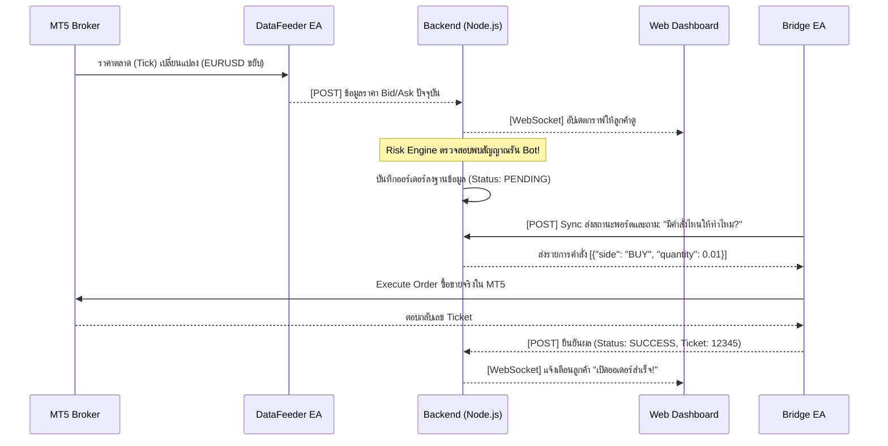
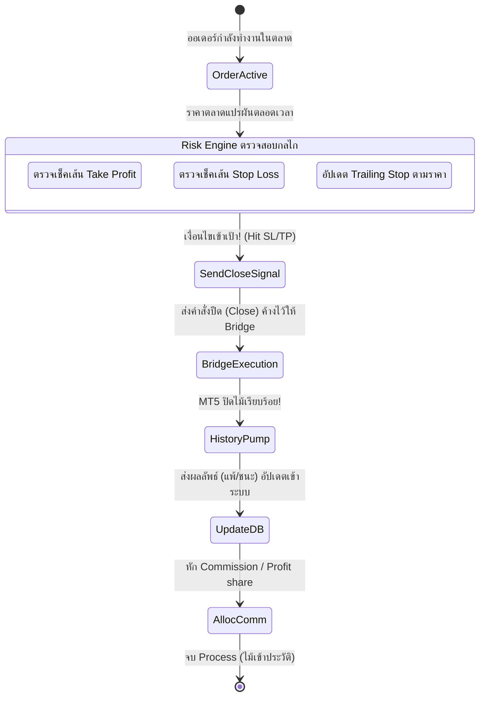

# 📊 NexusFX: System & Business Flows

## 1. Business Flow (ภาพรวมทางธุรกิจ)
ภาพรวมว่าลูกค้าและเงินทุนเดินอย่างไรภายในระบบ NexusFX:

```mermaid
flowchart TD
    A([เริ่ม: ผู้ใช้สมัครสมาชิก]) --> B(ฝากเงินเข้า Wallet / ธุรกรรม)
    B --> C{ผู้ใช้มีบัญชีเทรดเชื่อมต่อหรือยัง?}
    C -- "ยังไม่มี" --> D(เชื่อมต่อบัญชี MT5 หรือรับบัญชีใหม่)
    C -- "มีแล้ว" --> E(เลือก Strategy หรือตั้งค่า Copy Bot)
    D --> E
    E --> F[เริ่มการเทรดอัตโนมัติ (Auto Trading)]
    F --> G{ผลประกอบการ}
    G -- "กำไร" --> H[ระบบหัก / แบ่งเปอร์เซนต์รายได้ (Profit Sharing)]
    G -- "ขาดทุน" --> I[บันทึกประวัติ (History)]
    H --> J[กระจาย Commission ให้ Agent / IB]
    I --> K([สิ้นสุดรอบวัน])
    J --> K
    K --> L[ผู้ใช้เบิกถอนเงินจาก Wallet (Withdraw)]
```

---

## 2. System Flow (ภาพรวมสถาปัตยกรรมระบบ)
ส่วนประกอบทางเทคนิคคุยกันอย่างไร:

```mermaid
flowchart LR
    subgraph Frontend [ฝั่งผู้ใช้งาน]
        React[React.js Web App]
        Mobile[Mobile View]
    end

    subgraph Backend [NexusFX Backend API]
        NodeAPI[Node.js Gateway / API]
        Risk[Risk & Trailing Engine]
        Comm[Commission Engine]
        DB[(PostgreSQL Database)]
    end

    subgraph Broker [MT5 Trading Node]
        Bridge[NexusFX_Bridge EA]
        Feeder[NexusFX_DataFeeder]
        History[NexusFX_HistoryPump]
    end

    Frontend <-->|REST API / WebSockets| Backend
    NodeAPI <--> DB
    NodeAPI <-->|POST (Trade & Sync)| Bridge
    Feeder -->|POST (Live Tick Data)| NodeAPI
    History -->|POST (Close Trade Data)| NodeAPI
```

---

## 3. Data Flow Diagram (DFD ข้อมูลการเทรด)
การไหลเวียนของข้อมูลจากกราฟราคา สู่การเปิดไม้:



---

## 4. BPMN & Workflow (สำหรับรอบจบรอบออเดอร์)
ขั้นตอนกระบวนการ (Business Process Model) เมื่อถึงเวลาปิดไม้ทำกำไร:



---

## 5. เคสตัวอย่าง: (End-to-End Tracing Example)

### โครงเรื่อง: "ปลื้มใช้งานบอทเทรดทอง (XAUUSD) และได้กำไร"
1. **ตั้งค่า (Setup):** ปลื้มเติมเงิน 1,000 USD เข้า NexusFX Wallet แลกเปลี่ยนเข้าพอร์ต MT5 ของตัวเอง และเปิดการทำงานของบอทสายทองคำผ่านหน้าเว็บ React
2. **ประเมินตลาด (Data Feeder):** EA `DataFeeder` ที่รันอยู่ในตู้ INET คอยส่งราคาทองแบบสดๆ ยิงเข้าไปที่ Node.js Backend ทุกๆ เสี้ยววินาที
3. **เจอจังหวะยิง (Signal & Execution):** Node.js คำนวณตามสูตรบอทพบว่า **"ทองกำลังขึ้น ควรกด Buy 0.1 หลอด"** ระบบเลยแทรกคำสั่งไปรอไว้ EA `NexusFX_Bridge` ที่หมั่น Sync ถามข้อมูลทุกๆ 3 วินาที ก็คว้ารับคำสั่งนี้ไปรันกด Buy ใน MT5 ให้ปลื้มทันที! 💥 (ใช้เวลาแค่เสี้ยววินาที) แล้วส่งใบเสร็จมาบอกระบบ
4. **ตามจี้ (Trailing & Risk):** Backend จับตาลดความเสี่ยงให้ตลอดเวลา พร้อมปรับเลื่อนเส้น Stop loss ตามกำไร
5. **ทำกำไร (Take Profit):** เมื่อทองพุ่งไปแตะเส้น TP EA ใน MT5 ปิดไม้สำเร็จ ได้กำไร $50
6. **บันทึกลงระบบ (History Pump & Business):** EA `HistoryPump` ตรวจพบไม้ที่เพิ่งปิด เลยรีบส่งบิลสรุปที่ปิดเข้าหา Node.js ทันที Backend จัดการอัปเดตบาลานซ์เป็น 1,050 USD ใน Database และ Commission Engine คำนวณหักส่วนแบ่งร้อยละส่งต่อเข้ากระเป๋าของ IB/Agent ของปลื้มโดยอัตโนมัติ

จบวงจรระบบอัตโนมัติ 100% ครับ!
