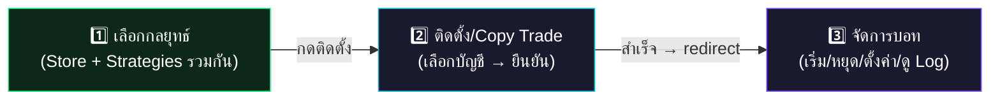

# 🔄 แผนปรับปรุง 3 หน้าให้ทำงานสอดคล้องกัน

## 📊 สถานะปัจจุบัน — ปัญหาที่พบ

### 3 หน้าที่เกี่ยวข้อง

| หน้า | Route | บทบาท | สถานะ |
|------|-------|--------|-------|
| **สโตร์กลยุทธ์** (Store) | `/store` | เลือกบอทสำเร็จรูป (Scalper, Grid, Martingale..) | ✅ ทำงานได้ |
| **ศูนย์รวมกลยุทธ์** (Strategies) | `/strategies` | Copy Trade จากนักเทรดจริง + สร้างกลยุทธ์เอง | ⚠️ ใช้งานซ้ำซ้อน |
| **เครื่องมือเทรดอัตโนมัติ** (Bots) | `/bots` | จัดการ Bot ที่ติดตั้งแล้ว (เริ่ม/หยุด/ตั้งค่า) | ✅ ทำงานได้ |

### ❌ ปัญหาหลัก

```mermaid
graph TD
    A["Store (สโตร์กลยุทธ์)"] -->|"ติดตั้งบอท → สร้าง Bot ใหม่"| C["Bots (จัดการบอท)"]
    B["Strategies (ศูนย์รวมกลยุทธ์)"] -->|"Copy Trade → ???"| D["❓ ไม่ไปไหน"]
    
    style A fill:#1a3a2a,stroke:#00e676
    style B fill:#3a1a1a,stroke:#ff5252
    style C fill:#1a2a3a,stroke:#00bcd4
    style D fill:#3a1a1a,stroke:#ff5252
```



1. **ซ้ำซ้อน** — ทั้ง Store และ Strategies มี Marketplace เหมือนกัน แต่ใช้ API คนละตัว
2. **ขาดการเชื่อมต่อ** — Store ติดตั้งบอทสำเร็จ → ต้องไปหน้า Bots เอง (ไม่มีลิงก์ตรง)
3. **ศูนย์รวมกลยุทธ์ว่างเปล่า** — Marketplace ในหน้า Strategies ไม่มีกลยุทธ์แสดง
4. **UX ไม่ต่อเนื่อง** — ผู้ใช้ไม่รู้ว่าควรเริ่มจากไหน → เลือกกลยุทธ์ที่ไหน → จัดการอะไรต่อ

---

## ✅ แผนที่เสนอ — รวม 3 หน้าให้ทำงานเป็น Flow เดียว

### User Journey ที่ควรเป็น



---

## 🏗️ แผนปรับปรุง — 2 ทางเลือก

### ทางเลือก A: รวม Store + Strategies เป็นหน้าเดียว (แนะนำ ⭐)

> **เหลือ 2 หน้า** แทน 3 หน้า — ลดความสับสน

| หน้าใหม่ | เนื้อหา |
|----------|---------|
| **📦 Marketplace** (`/store`) | รวมทั้ง "บอทสำเร็จรูป" + "กลยุทธ์จากนักเทรด" ไว้ที่เดียว โดยใช้ **Tab** แยกประเภท |
| **🤖 Trading Bots** (`/bots`) | จัดการบอททั้งหมดที่ติดตั้งแล้ว (เหมือนเดิม) |

**โครงสร้างหน้า Marketplace ใหม่:**

```
┌─────────────────────────────────────────────────┐
│  📦 Marketplace                      [บัญชี: v] │
├─────────────────────────────────────────────────┤
│  [🤖 บอทสำเร็จรูป] [👤 Copy จากเทรดเดอร์] [📝 กลยุทธ์ของฉัน] │
├─────────────────────────────────────────────────┤
│  🟢 กลยุทธ์พื้นฐาน — ฟรีสำหรับสมาชิกทุกคน     │
├─────────────────────────────────────────────────┤
│  ┌──────┐  ┌──────┐  ┌──────┐  ┌──────┐        │
│  │Scalper│  │Swing │  │Grid  │  │Martin│        │
│  │      │  │      │  │      │  │      │        │
│  │[ติดตั้ง]│ │[ติดตั้ง]│ │[ติดตั้ง]│ │[ติดตั้ง]│       │
│  └──────┘  └──────┘  └──────┘  └──────┘        │
└─────────────────────────────────────────────────┘
```

**ข้อดี:**
- ผู้ใช้เห็นทุกอย่างที่เดียว ไม่ต้องเปลี่ยนหน้า
- ลด sidebar items ลง
- Tab "กลยุทธ์ของฉัน" สำหรับ Master Trader สร้าง Signal

---

### ทางเลือก B: เก็บ 3 หน้าแยก แต่เชื่อมต่อให้ดีขึ้น

> **เก็บ 3 หน้าเหมือนเดิม** แต่เพิ่มการเชื่อมต่อ

| ปรับปรุง | รายละเอียด |
|----------|-----------|
| **เพิ่ม Navigate** | Store → กดติดตั้ง → redirect ไปหน้า Bots ทันที |
| **เพิ่ม Breadcrumb** | Bots แสดงว่า "ติดตั้งจาก Store" หรือ "Copy จากกลยุทธ์ X" |
| **ลิงก์ข้ามหน้า** | Bots → กดดูกลยุทธ์ต้นทาง → ลิงก์ไป Strategies |
| **แก้ Strategies** | Marketplace ใน Strategies → ใช้ API เดียวกับ Store |

---

## 🎯 สิ่งที่ควรทำทันที (Quick Wins)

### 1. เชื่อม Store → Bots (Redirect หลังติดตั้ง)
```jsx
// StorePage.jsx — หลัง purchaseBot สำเร็จ
if (res.success) {
  alert('ติดตั้งบอทสำเร็จ! กำลังไปหน้าจัดการบอท...');
  navigate('/bots');  // ← เพิ่มตรงนี้
}
```

### 2. ลบ Strategies Marketplace tab (ซ้ำซ้อนกับ Store)
- เก็บเฉพาะ Tab "กลยุทธ์ของฉัน" ไว้สำหรับ Master Trader

### 3. เพิ่มปุ่มลัดใน Bots → กลับ Store
```jsx
// BotsPage.jsx — header
<button onClick={() => navigate('/store')}>
  + เพิ่มกลยุทธ์จาก Store
</button>
```

### 4. UI สม่ำเสมอ
- การ์ดทุกหน้าใช้ `className="card"` เดียวกัน ✅ (ทำแล้ว)
- ปุ่มใช้ `.btn .btn-primary .btn-sm` เหมือนกัน
- Layout grid ใช้ `minmax(300px, 1fr)` เหมือนกัน

---

## 📋 คำถามสำหรับตัดสินใจ

> [!IMPORTANT]
> กรุณาเลือกทิศทางที่ต้องการ:

1. **ทางเลือก A** — รวม Store + Strategies เป็นหน้าเดียว (แนะนำ)
2. **ทางเลือก B** — เก็บ 3 หน้าแยก เพิ่มการเชื่อมต่อ
3. **Quick Wins เท่านั้น** — แค่เพิ่ม redirect + ลิงก์ข้ามหน้า ไม่ปรับโครงสร้าง

เมื่อเลือกแล้ว ผมจะเริ่มทำให้ทันทีครับ!
