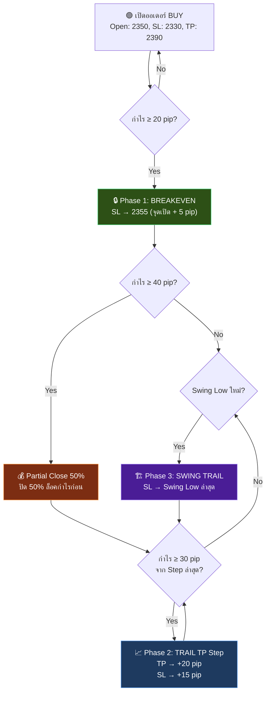

# 📐 Trailing SL/TP Concept — NexusFX PriceActionBot

## ภาพรวม: ระบบ 3 Phase + Trailing TP



---

## ⚙️ Input Parameters ใหม่

| Parameter | ค่าเริ่มต้น | คำอธิบาย |
|---|---|---|
| `BreakevenPips` | **20.0** | ราคาวิ่งเท่านี้แล้วจึงย้าย SL มาจุดเปิด |
| `LockProfitPips` | **5.0** | ล็อคกำไรเท่านี้เมื่อถึง Breakeven |
| `TrailingBars` | **3** | แท่งเทียนย้อนหลังสำหรับหา Swing Low/High |
| `TrailMinGap` | **10.0** | SL ต้องห่างจากราคาอย่างน้อยกี่ pip |
| `UseTrailingTP` | **true** | เปิดระบบเลื่อน TP ตามกำไร |
| `TP_TrailStepPips` | **30.0** | ทุกๆ 30 pip ที่วิ่งเพิ่ม → เลื่อน TP |
| `TP_ExtendPips` | **20.0** | เลื่อน TP ไปข้างหน้าอีก 20 pip |
| `SL_StepUpPips` | **15.0** | พร้อมกัน เลื่อน SL ขึ้นตาม 15 pip |
| `UsePartialClose` | **true** | ปิดบางส่วนเมื่อถึงเป้าแรก |
| `PartialClosePct` | **50.0** | ปิด 50% ของ Volume |

---

## 🎯 3 Phase ทำงานอย่างไร (BUY Example)

### สมมติ: เปิด BUY XAUUSD @ 2350, SL = 2330, TP = 2390

---

### Phase 0: INIT (ยังไม่ถึง BE)

| ราคา | SL | TP | สถานะ |
|---|---|---|---|
| **2350 → 2365** | 2330 | 2390 | ⏳ กำลังวิ่ง +15 pip (ยังไม่ถึง BE 20 pip) |

> [!NOTE]
> ไม่ทำอะไร — SL/TP คงที่

---

### Phase 1: BREAKEVEN 🔒

**เงื่อนไข:** กำไร ≥ `BreakevenPips` (20 pip)

| ราคา | SL | TP | Action |
|---|---|---|---|
| **2370** (+20 pip) | ~~2330~~ → **2355** | 2390 | ✅ SL ย้ายมาจุดเปิด + 5 pip |

```
เดิม:  SL ────────────── Open ──────── Price ──── TP
หลัง:                    Open ── SL ── Price ──── TP
                               (+5pip)
```

> [!TIP]
> **ทำไม Lock +5 pip?** เพราะ Spread + Commission ~ 2-3 pip สำหรับ Gold ถ้า SL = จุดเปิดพอดี → อาจปิดขาดทุนจาก Spread

---

### Partial Close 💰

**เงื่อนไข:** กำไร ≥ `BreakevenPips * 2` (40 pip) + ยังไม่เคย partial close

| ราคา | Volume | Action |
|---|---|---|
| **2390** (+40 pip) | 0.05 → **0.03** | ✅ ปิด 50% (0.02 lot) ล็อคกำไร |

> [!IMPORTANT]
> **ทำไม Partial Close?** ป้องกันราคาวิ่งกลับ — เอากำไรครึ่งหนึ่งเข้ากระเป๋าก่อน ส่วนที่เหลือปล่อยวิ่งต่อ

---

### Phase 2: TRAILING TP + SL STEP 📈

**เงื่อนไข:** ทุกๆ `TP_TrailStepPips` (30 pip) ที่ราคาวิ่งเพิ่ม

| Step | ราคาถึง | SL ใหม่ | TP ใหม่ | Action |
|---|---|---|---|---|
| Step 1 | **2380** (+30) | ~~2355~~ → **2365** | ~~2390~~ → **2410** | TP +20, SL +15 |
| Step 2 | **2410** (+60) | ~~2365~~ → **2380** | ~~2410~~ → **2430** | TP +20, SL +15 |
| Step 3 | **2440** (+90) | ~~2380~~ → **2395** | ~~2430~~ → **2450** | TP +20, SL +15 |

```
Step 1:  Open ───── SL ──────── Price ──── TP
Step 2:  Open ──────── SL ────── Price ─── TP     (SL ขยับ, TP ขยับ)
Step 3:  Open ─────────── SL ─── Price ── TP      (ยิ่งวิ่ง ยิ่งล็อค)
```

> [!TIP]
> **Concept: "กำไรที่ได้แล้วห้ามคืน"** — ทุกครั้งที่ราคาวิ่ง +30 pip, SL จะขยับ +15 pip = ล็อคกำไร 50% ของ momentum

---

### Phase 3: SWING STRUCTURE TRAIL 🏗️

**เงื่อนไข:** SL ผ่านจุด BE แล้ว + มี Swing Low ใหม่ที่ดีกว่า

| Swing Low ใหม่ | SL ปัจจุบัน | SL ใหม่ | Action |
|---|---|---|---|
| **2402** | 2395 | **2400** (Swing -2 pip) | ✅ SL ยึด Swing Low ใหม่ |
| **2415** | 2400 | **2413** (Swing -2 pip) | ✅ SL ตาม Swing Logic |

> [!NOTE]
> **Phase 3 ทำงานร่วมกับ Phase 2** — ใช้ค่าที่สูงกว่าเสมอ (Swing vs Step)

---

## 📊 ตัวอย่างเต็มวงจร (XAUUSD BUY)

```
ราคา:  2350 ──── 2370 ──── 2390 ──── 2410 ──── 2440 ──── 2450? TP ✅
         │         │         │         │         │
   [เปิด BUY]  [Phase 1]  [Partial]  [Step 1]  [Step 2]
    SL=2330    SL=2355    Close 50%  SL=2365   SL=2380
    TP=2390    TP=2390    TP=2390    TP=2410   TP=2430

ผลลัพธ์:
• 50% ปิดที่ +40 pip (Partial) = $40
• 50% ปิดที่ TP 2430 (+80 pip) = $80
• หรือถ้า SL ชน 2380 → ยังได้ +30 pip = $30
• รวมทั้งหมด: $70-$120 (จากทุน $100 ที่ Risk 1%)
```

---

## ❌ ตัวอย่าง: ราคาวิ่งกลับ (ป้องกันการเสียกำไร)

```
ราคา:  2350 ──── 2380 ──── 2360 ⬇️ ย้อนกลับ!
         │         │         │
   [เปิด BUY]  [Phase 1]  [SL ชน 2355]
    SL=2330    SL=2355     ✅ ปิดที่กำไร +5 pip
    
❌ ถ้าไม่มี Trailing: SL ยังอยู่ 2330 → ขาดทุน -20 pip!
✅ มี Trailing: ล็อคกำไรได้ +5 pip แม้ราคาย้อน
```

---

## 🔴 สำหรับ SELL Position

ทำงานกลับด้าน (Mirror):
- Phase 1: SL ลงมาที่จุดเปิด - LockProfitPips
- Phase 2: TP ขยับลง, SL ขยับลง
- Phase 3: SL ยึด **Swing High** ล่าสุด

---

## 📋 สรุปเงื่อนไขแต่ละ Phase

| Phase | Trigger | SL Action | TP Action | ปิดบางส่วน |
|---|---|---|---|---|
| **0 Init** | เปิดออเดอร์ | คงที่ (หลังโครงสร้าง W/M) | คงที่ (ก่อน S/R) | ❌ |
| **1 BE** | กำไร ≥ 20 pip | → จุดเปิด + 5 pip | คงที่ | ❌ |
| **Partial** | กำไร ≥ 40 pip | คงที่ | คงที่ | ✅ 50% |
| **2 Trail** | ทุก 30 pip วิ่ง | +15 pip ต่อ step | +20 pip ต่อ step | ❌ |
| **3 Swing** | Swing Low/High ใหม่ | → Swing - 2 pip | คงที่ | ❌ |
| **RSI Exit** | RSI ≥ 70 / ≤ 30 | ปิดทันที (มีกำไร) | - | ✅ 100% |
