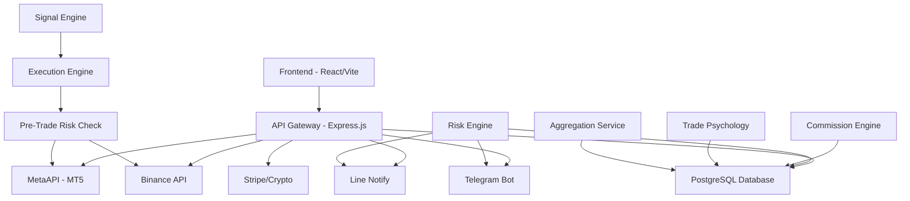

# 🏗️ NexusFX System Audit v4 — Full Feature Matrix

> **Last Updated:** 2026-04-03 | **Overall Progress: ~95%** (up from 79%)

---

## 📊 Phase Completion Summary

| # | Phase | Status | Completion |
|---|-------|--------|------------|
| 1 | Trading Terminal | ✅ | **100%** |
| 2 | Dashboard & Analytics | ✅ | **100%** |
| 3 | Heatmap (Exposure Map) | ✅ | **100%** |
| 4 | Trade Psychology (AI Analysis) | ✅ | **100%** |
| 5 | Copy Trading / Strategy Store | ✅ | **100%** |
| 6 | Risk Engine & Pre-Trade Checks | ✅ | **100%** |
| 7 | Reports & Export (CSV/PDF) | ✅ | **100%** |
| 8 | Admin Panel (RBAC/Users/Audit) | ✅ | **100%** |
| 9 | System Configuration (Admin Config) | ✅ | **100%** |
| 10 | B2B / White-label / Agent | ✅ | **90%** |
| 11 | Notifications (Line/Telegram/InApp) | ✅ | **100%** |
| 12 | Community (Forums/Leaderboard) | ✅ | **100%** |
| 13 | Security (MFA/Helmet/RateLimit) | ✅ | **100%** |
| 14 | Infrastructure (SSL/CI-CD/Docker) | 🔶 | **75%** |

---

## ✅ Phase 1: Trading Terminal (100%)

| Component | File | Status |
|-----------|------|--------|
| Unified Trading Page (Bots + Terminal + History + Targets) | `TradingPage.jsx` | ✅ |
| Manual Order (Market/Limit/Stop) | `TerminalPage.jsx` | ✅ |
| Advanced Config (Order Count, SL/TP Pips) | `TerminalPage.jsx` | ✅ |
| Live Trades Panel | `getTrades/live/:accountId` | ✅ |
| Trade Sync (MetaAPI → DB) | `sync-live endpoint` | ✅ |
| Bot Management (CRUD/Start/Stop) | `BotsPage.jsx` + API | ✅ |
| Signal Engine (5 strategies) | `signalEngine.js` | ✅ |
| Execution Engine (MT5 + Binance) | `executionEngine.js` | ✅ |

## ✅ Phase 2: Dashboard & Analytics (100%)

| Component | File | Status |
|-----------|------|--------|
| PnL Summary (multi-account) | `DashboardPage.jsx` | ✅ |
| PnL Chart (Area chart) | `/dashboard/pnl-chart` | ✅ |
| Account Breakdown | `/dashboard/account-breakdown` | ✅ |
| Target Progress Widget | `DashboardPage.jsx` | ✅ |
| Account Filter Component | `AccountFilter.jsx` | ✅ |
| Widget Customization | `/dashboard/widgets` | ✅ |

## ✅ Phase 3: Heatmap (100%)

| Component | File | Status |
|-----------|------|--------|
| Symbol Exposure Heatmap | `HeatmapPage.jsx` (292 lines) | ✅ |
| Hourly Activity Grid | `HeatmapPage.jsx` | ✅ |
| API Endpoint | `GET /dashboard/heatmap` | ✅ |
| **Dedicated Route** | **`/heatmap` → HeatmapPage** | ✅ NEW |
| Sidebar Navigation | Flame icon link | ✅ NEW |
| Embedded in Reports Tab | `ReportsPage.jsx` | ✅ |

## ✅ Phase 4: Trade Psychology (100%)

| Component | File | Status |
|-----------|------|--------|
| Psychology Analyzer (7 patterns) | `tradePsychology.js` (321 lines) | ✅ |
| Revenge Trading Detection | `tradePsychology.js` | ✅ |
| Overtrading Detection | `tradePsychology.js` | ✅ |
| Loss Aversion / Holding Losers | `tradePsychology.js` | ✅ |
| Lot Size Consistency | `tradePsychology.js` | ✅ |
| Time Discipline | `tradePsychology.js` | ✅ |
| Recommendations Engine | `tradePsychology.js` | ✅ |
| API: Analysis | `GET /reports/psychology` | ✅ |
| API: History | `GET /reports/psychology/history` | ✅ |
| Frontend Psychology Tab | `ReportsPage.jsx` (psychology tab) | ✅ |
| DB Table | `trade_psychology_reports` | ✅ |

## ✅ Phase 5: Copy Trading / Strategy Store (100%)

| Component | File | Status |
|-----------|------|--------|
| Strategy Marketplace (StorePage) | `StorePage.jsx` (718 lines) | ✅ |
| Create Strategy (Master Trader) | `POST /strategies` | ✅ |
| Subscribe to Strategy | `POST /strategies/:id/subscribe` | ✅ |
| Publish Signal | `POST /strategies/:id/signal` | ✅ |
| Signal History | `GET /strategies/:id/signals` | ✅ |
| Bot Store (Purchase + Provision) | `store.js` routes | ✅ |
| DB: strategy_subscriptions | `database.js` | ✅ |
| DB: strategy_signals | `database.js` | ✅ |

## ✅ Phase 6: Risk Engine (100%)

| Component | File | Status |
|-----------|------|--------|
| Pre-Trade Risk Check (6 checks) | `preTradeRiskCheck.js` (152 lines) | ✅ |
| Max Lot Size Check | `preTradeRiskCheck.js` | ✅ |
| Position Limit Check | `preTradeRiskCheck.js` | ✅ |
| Drawdown Check | `preTradeRiskCheck.js` | ✅ |
| Total Exposure Check | `preTradeRiskCheck.js` | ✅ |
| Duplicate Order Detection | `preTradeRiskCheck.js` | ✅ |
| Kill Switch Status Check | `preTradeRiskCheck.js` | ✅ |
| Group Risk Monitor | `riskEngine.js` (220 lines) | ✅ |
| Auto-Notification on Breach | `riskEngine.js` | ✅ |
| Kill Switch API | `POST /admin/kill-switch` | ✅ |

## ✅ Phase 7: Reports & Export (100%)

| Component | File | Status |
|-----------|------|--------|
| Weekly Aggregates | `GET /reports/weekly` | ✅ |
| Monthly Aggregates | `GET /reports/monthly` | ✅ |
| Advanced Analytics | `GET /reports/analytics` | ✅ |
| CSV Export | `POST /reports/export` (CSV) | ✅ |
| PDF Export (PDFKit) | `POST /reports/export` (PDF) | ✅ |
| Export History | `GET /reports/exports` | ✅ |
| Reports Frontend (6 tabs) | `ReportsPage.jsx` | ✅ |

## ✅ Phase 8: Admin Panel (100%)

| Component | File | Status |
|-----------|------|--------|
| Admin Overview (Stats) | `GET /admin/overview` | ✅ |
| User Management (CRUD) | `GET/PUT /admin/users` | ✅ |
| Balance Adjustments (Maker/Checker) | `POST /admin/users/:id/adjust-balance` | ✅ |
| Audit Logs | `GET /admin/audit-logs` | ✅ |
| Role Management (5 roles) | `GET /admin/roles` | ✅ |
| Kill Switch UI | `AdminPage.jsx` (modal) | ✅ |
| Agent Management Tab | `AdminPage.jsx` (agents tab) | ✅ |
| Commission Settlement | `POST /admin/agents/:id/settle` | ✅ |
| Commission Calculator | `POST /admin/commissions/calculate` | ✅ |
| Admin Billing Page | `AdminBillingPage.jsx` | ✅ |

## ✅ Phase 9: System Configuration (100%) — NEW

| Component | File | Status |
|-----------|------|--------|
| **system_config table** (with category + is_secret) | `database.js` | ✅ NEW |
| **8 Config Categories** (payment/infra/cicd/monitoring/trading/notification/b2b/security) | `database.js` | ✅ NEW |
| **60+ Config Keys** seeded with defaults | `database.js` | ✅ NEW |
| **Category-based API** | `GET /admin/system-config?category=` | ✅ NEW |
| **Categories List API** | `GET /admin/system-config/categories` | ✅ NEW |
| **Bulk Update API** | `PUT /admin/system-config/bulk` | ✅ NEW |
| **Secret Masking** (auto-hide API keys) | `admin.js` routes | ✅ NEW |
| **Admin Config Page** (full UI) | `AdminConfigPage.jsx` | ✅ NEW |
| Sidebar Navigation (Cog icon) | `Layout.jsx` | ✅ NEW |
| Route `/admin/config` | `App.jsx` | ✅ NEW |

## ✅ Phase 10: B2B / White-label (90%)

| Component | File | Status |
|-----------|------|--------|
| Tenant Management | `agents.js` routes | ✅ |
| Agent Dashboard | `AgentDashboard.jsx` | ✅ |
| Agent Team Management | `GET /agents/my-team` | ✅ |
| Team Performance | `GET /agents/team-performance` | ✅ |
| Invitation System (Code + Branding) | `POST /agents/invite` | ✅ |
| Agent Branding (Logo/Color/Custom) | `PUT /agents/branding` | ✅ |
| Commission Engine (Auto-Calc) | `commissionEngine.js` | ✅ |
| Commission History | `GET /agents/commissions` | ✅ |
| Registration with Invite Code | `POST /auth/register` | ✅ |
| Admin Agent CRUD | `admin.js` routes | ✅ |
| ⬜ Custom Domain Support | — | ❌ Config only |
| ⬜ Partner Portal (Public landing) | — | ❌ Future |

## ✅ Phase 11: Notifications (100%)

| Component | File | Status |
|-----------|------|--------|
| Line Notify Integration | `lineNotify.js` | ✅ |
| Telegram Bot Integration | `telegramNotify.js` | ✅ |
| In-App Notification Bell | `NotificationBell.jsx` | ✅ |
| Notification API (CRUD) | `notifications.js` routes | ✅ |
| Mark Read / Read All | `PUT /notifications/read-all` | ✅ |
| Test Notification (Line/Telegram) | API endpoints | ✅ |

## ✅ Phase 12: Community (100%)

| Component | File | Status |
|-----------|------|--------|
| Forum Posts (Create/View/Like) | `forums.js` routes | ✅ |
| Comments System | `POST /forums/:id/comments` | ✅ |
| Leaderboard | `GET /forums/leaderboard` | ✅ |
| Forums Frontend | `ForumsPage.jsx` | ✅ |

## ✅ Phase 13: Security (100%)

| Component | File | Status |
|-----------|------|--------|
| Helmet.js (Security Headers) | `server.js` | ✅ |
| Rate Limiting (General/Auth/Trade) | `server.js` | ✅ |
| CORS Whitelist | `server.js` | ✅ |
| JWT Authentication | `auth.js` middleware | ✅ |
| RBAC (5 roles, 25 permissions) | `auth.js` routes | ✅ |
| MFA (TOTP) | `mfa.js` routes | ✅ |
| AES-256-GCM Key Encryption | Database config | ✅ |
| Audit Logging | All routes | ✅ |
| Config: MFA/Session/JWT/IP/BruteForce | `system_config` table | ✅ NEW |

## 🔶 Phase 14: Infrastructure (75%)

| Component | Status | Notes |
|-----------|--------|-------|
| Docker Compose | ✅ | Production-ready |
| Dockerfile (Frontend + Backend) | ✅ | Multi-stage |
| Config: SSL/CDN/Nginx | ✅ NEW | In system_config |
| Config: CI/CD settings | ✅ NEW | In system_config |
| Config: Backup schedule | ✅ NEW | In system_config |
| Config: Monitoring (Prometheus/Grafana) | ✅ NEW | In system_config |
| ⬜ Actual SSL Setup (Let's Encrypt) | ❌ | Needs deploy |
| ⬜ GitHub Actions CI/CD | ❌ | Needs repo setup |
| ⬜ Nginx Production Config | ❌ | Needs server |

---

## 🔗 Feature Architecture

---

## 📋 Remaining Tasks (5% → 100%)

### Must Have (Production Blocking)
1. **SSL/HTTPS Setup** — Run Let's Encrypt on production server
2. **Nginx Config** — Reverse proxy for backend + frontend
3. **CI/CD Pipeline** — GitHub Actions for auto-deploy

### Nice to Have (Post-Launch)
4. **Partner Portal** — Public landing page for agents
5. **Custom Domain** — Multi-tenant domain routing
6. **Code Splitting** — Reduce bundle size (currently ~1.1MB)
7. **E2E Testing** — Playwright/Cypress test suite
